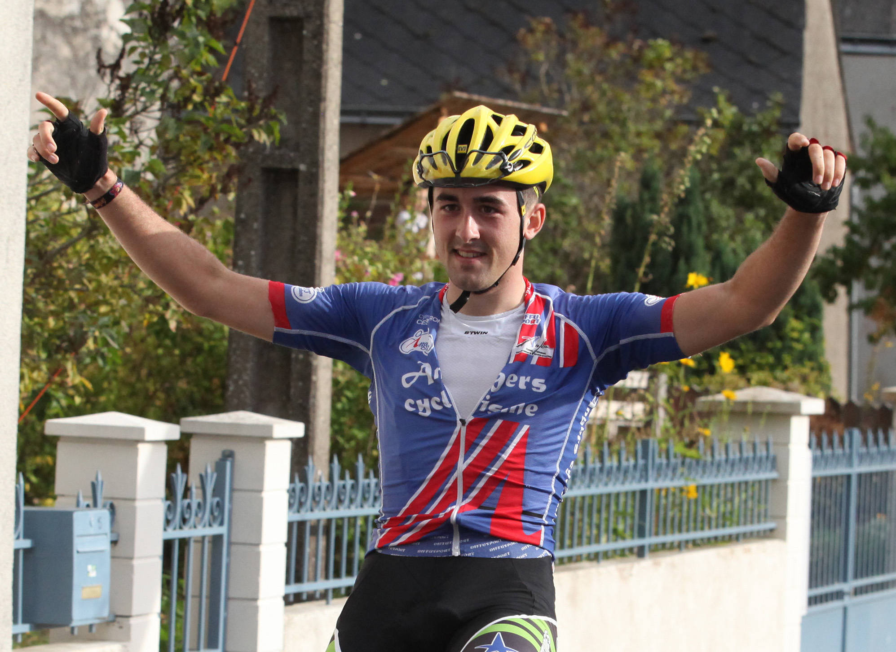
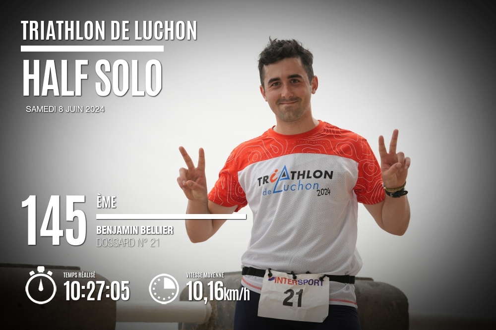
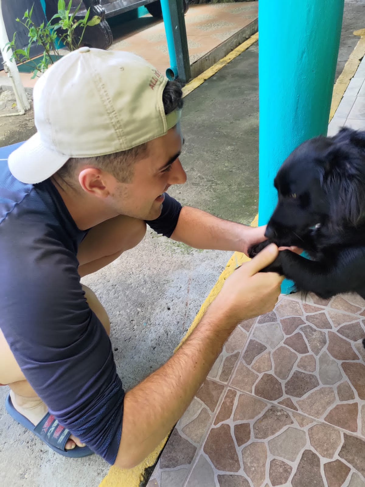
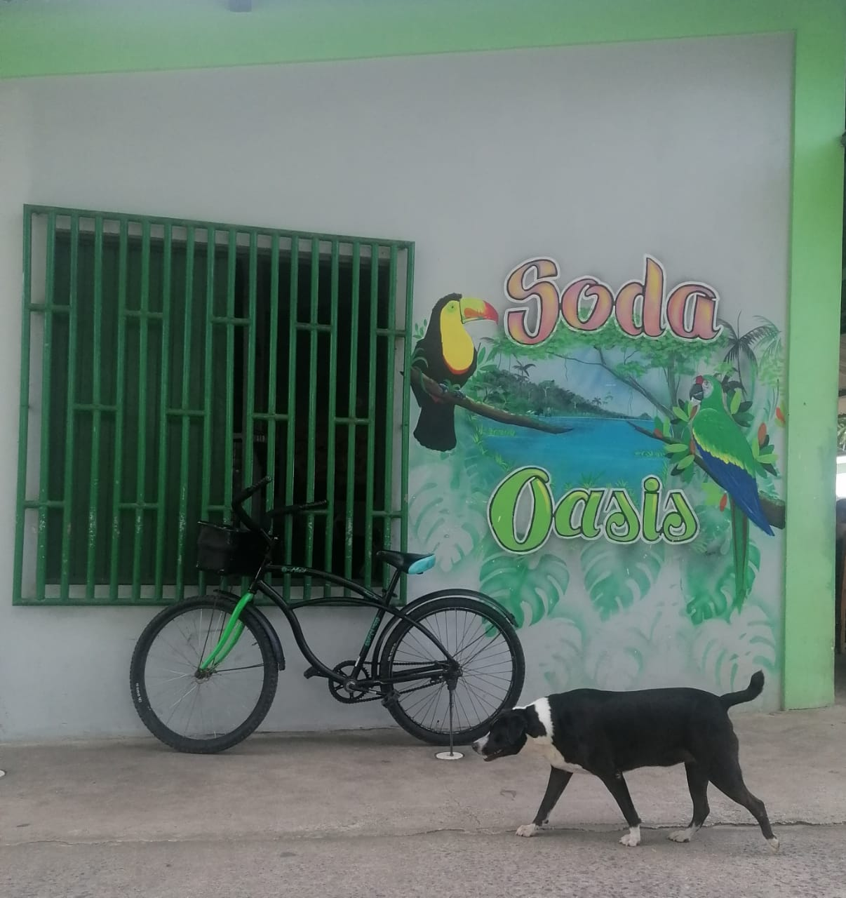

## Myself

I'm an engineer working on the effects of various stress factors (chemicals, temperature, *etc.*) on aquatic animals. Indeed, in a world where industrial sectors dominate, studying their effects on biota and the diversity that makes it up seems essential to me. I believe that our children have the right to discover what we have discovered with our own eyes, as long as it respects the concept described by Elton John: "It's the circle of life".

I am also a big fan of coding, particularly with [RStudio](https://posit.co/). Yes, I know it's strange... But I'm also a big sports fan: cycling, athletics, basketball, *etc.*

## Sport

I have been practicing cycling at a high level since my childhood ([Direct Vélo](https://www.directvelo.com/coureur/18262/benjamin-bellier)), and I even won with my team ([Vélo Club Lucéen](https://www.velo-club-luce-28.com/)) the French National 3 Cup in 2021. Otherwise, I am extremely knowledgeable about the subject and Interesting fact: I am one of the few people who can keep from falling asleep during an entire stage of the Tour de France.

{width="394"}

Now, I've stopped cycling... But to discover triathlon, just to suffer a little more. I recently completed the Luchon half iron man (certificate below). Yes, it's true, I didn't go very fast...

{width="394"}

## Costa Rica

I had the opportunity to live in Costa Rica for \~1 year. I was able to discover many of nature's wonders, especially on my first month's backpacking trip. The fruit there is so good! As always, I totally enjoyed man's best friend (see proof below). The country's atmosphere is truly atypical and many places are so unique.

{width="278"}

{width="278"}

{width="278"}

{width="278"}

