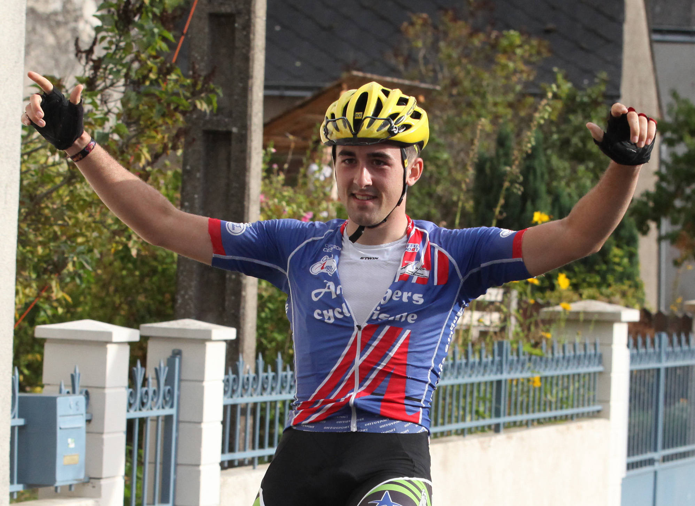

---
#Titre de la page à afficher
title: "About this site"
output:
  distill::distill_article:
    toc: true
---

## Myself

I am a studies engineer working on the effects of various stressors (chemicals, temperature, etc.) on aquatic animals. I am also a huge fan of coding, particularly with [RStudio](https://posit.co/).

## Cyclism

I have been practicing cycling at a high level since my childhood ([Direct Vélo](https://www.directvelo.com/coureur/18262/benjamin-bellier)) and I am extremely knowledgeable about the subject. Interesting fact: I am one of the few people who can keep from falling asleep during an entire stage of the Tour de France.

{width="394"}

## Costa Rica

I had the opportunity to live in Costa Rica for \~1 year. I was able to discover many of nature's wonders, particularly during my first backpacking trip.

{width="278"}

